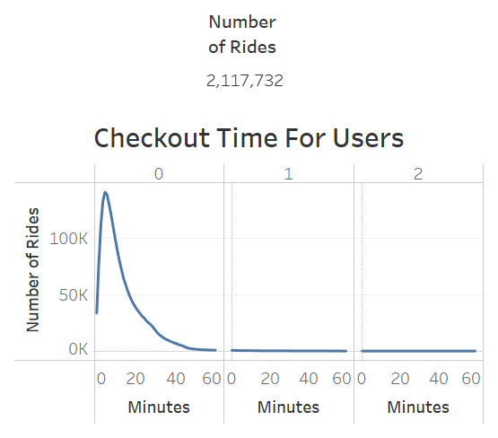
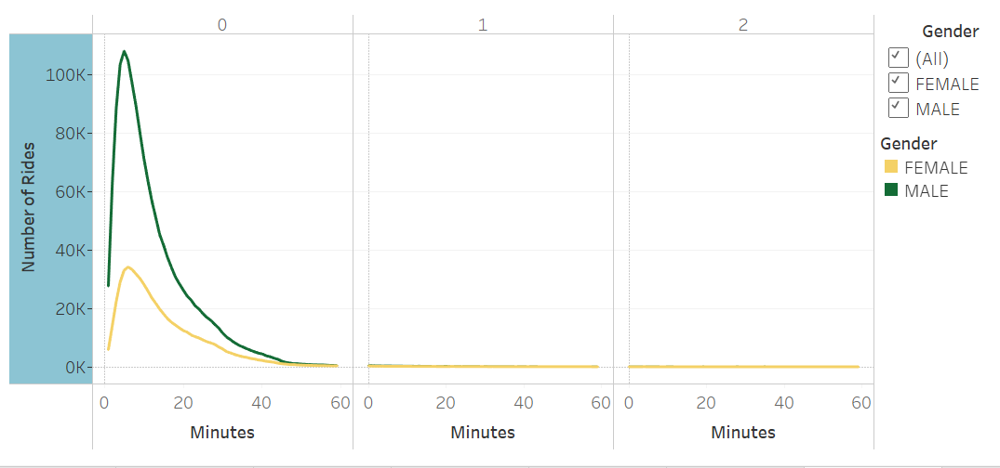
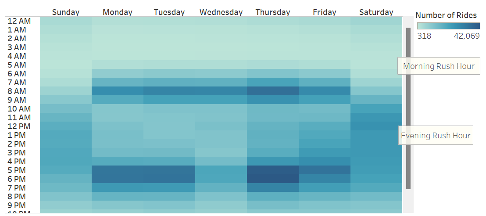
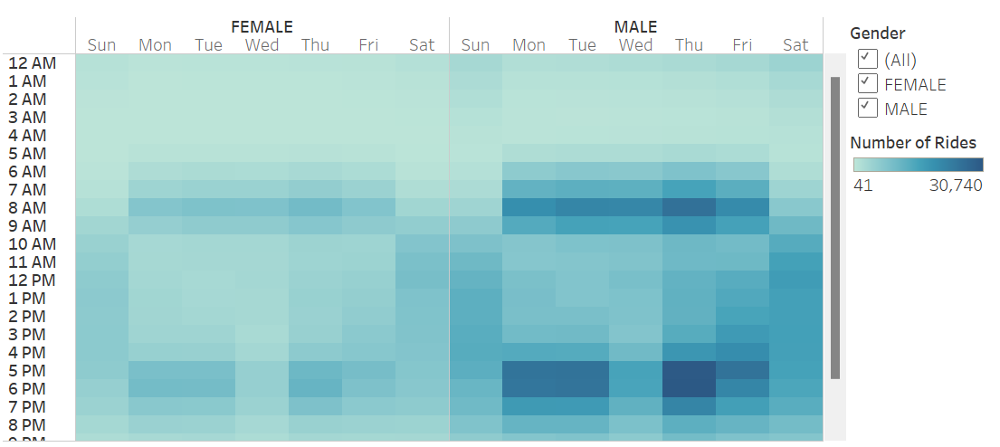
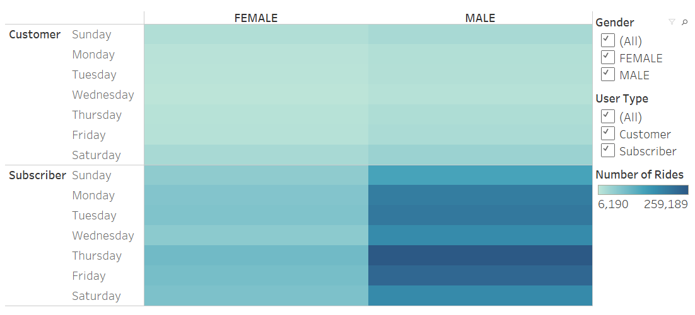

# Bikesharing

## Overview

This is an analysis of Citibike user data from New York City in August 2019. It uses Tableau to show the number of rides, the most popular days and times for riders, differences in number of rides for subscribers vs. regular customers, and most popular start locations. This could hypothetically be used as part of a business proposal to expand the service to a new city.

- Please note that the raw data included an "Unknown" gender option. Errors in birth year for this category makes it clear that this is faulty data rather than intentional self-ID; "Unknown" has therefore been excluded from graphs breaking down gender.

[link to dashboard](https://public.tableau.com/app/profile/christine.gendron/viz/Bikesharing_Data/CitibikeAnalysis)

## Results

- The two below visualizations show total number of rides and the length of those rides across all users:

- This graph shows that men and women ride for roughly the same amount of time per ride.

- This heatmap shows the number of rides broken down by day of the week and hour of the day. It shows that the most rides take place during the morning and evening rush hours.

- This heatmap expands on the previous one, showing that men and women ride at similar times.

- The below heatmap shows differences in patterns between users who subscribe to the service and users who don't. Men who subscribe to Citibike ride the most often.

- Finally, this map shows the starting stations in Manhatten by popularity. Generally, the most popular stations are in lower Manhattan.

## Summary

- Based on this Analysis, the times when most users are active are weekday rush hours. Subscribers are also the most likely to be riding during these times. Men use Citibike significantly more often than women. The stations that are used most often are downtown. This indicates that core users are men who regularly use Citibike to commute to and from work.

- Furthur analysis suggestions:

-- We could break down overall rides by the age of the rider.
-- We could break down ride length by age.
-- We could look at the frequency that specific bikes are ridden.
